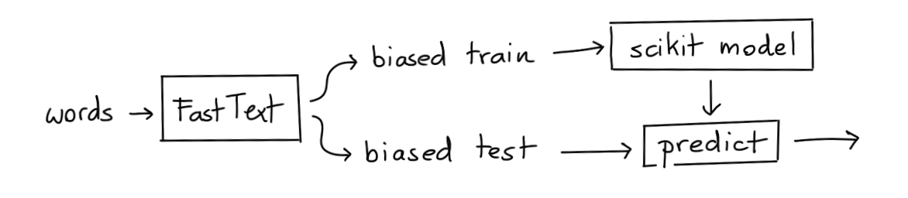
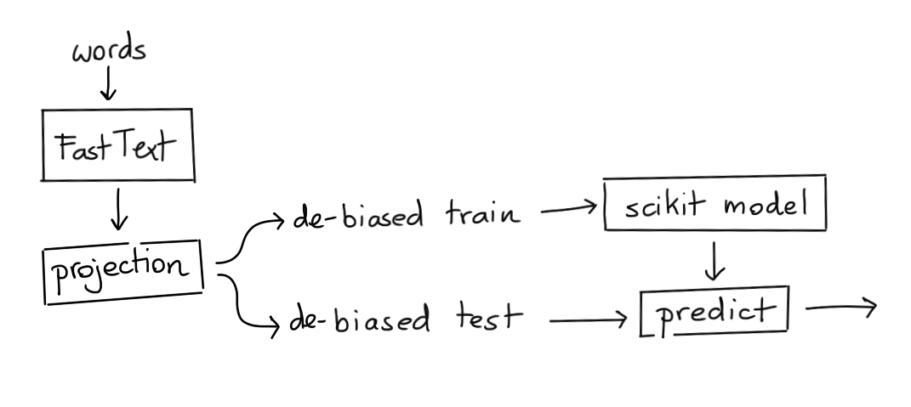

In this example we'd like to discuss the effectiveness of debiasing techniques in word embeddings.
This example is heavily inspired by the ["Lipstick on a Pig"](https://arxiv.org/pdf/1903.03862.pdf) paper
by Hila Gonen and Yoav Goldberg.

## Meaning

In word embedding space you might wonder if a direction in embedding space might represent meaning.

- $v_{man}$ represents the word embedding for "man" .
- $v_{woman}$ represents the word embedding for "woman" .
- You could argue that the axis $v_{man} - v_{woman}$ might represent "gender".

One side of the "gender" axis would represent the male gender while the other end represents the female gender. This spectrum might allow you to guess if words are more "male" or more "female". It can also be used as a measurement for bias in language.

## Similarity

There are some axes that we might come up with that should be similar to this gender axis, like:

- $v_{he} - v_{she}$
- $v_{king} - v_{queen}$
- $v_{brother} - v_{sister}$

It would be highly unfortunate though if the following pairs of words would display similarity:

- $v_{nurse} - v_{physician}$
- $v_{nurse} - v_{surgeon}$
- $v_{nurse} - v_{doctor}$

Being a nurse should not imply that you are a woman just like that being a surgeon should not imply that you are a man. It'd be a shame if we were using embeddings where such stereotypical bias is present. Unfortunately, it's likely in the embeddings. Historically, women have not gotten the same opportunities as men. This is bound to be reflected on websites like Wikipedia which are a common source of data to train word embeddings. So let's make a distance chart to confirm if this is the case.

<details>
  <summary><b>Word Pairs</b></summary>
```python
stereotype_pairs = [
    ('sewing', 'carpentry'),
    ('nurse', 'physician'),
    ('nurse', 'surgeon'),
    ('nurse', 'doctor'),
]

appropriate_pairs = [
    ('woman', 'man'),
    ('she', 'he'),
    ('her', 'him'),
    ('girl', 'boy')
]

random_pairs = [
    ('dog', 'firehydrant'),
    ('carpet', 'leg'),
    ('hot', 'cold'),
]

all_pairs = [stereotype_pairs, appropriate_pairs, random_pairs]
```
</details>

```python
from whatlies import Embedding, EmbeddingSet
from whatlies.language import FasttextLanguage

lang_ft = FasttextLanguage("cc.en.300.bin")

flatten = lambda l: [item for sublist in l for item in sublist]

def calc_axis(pair_list, language_model):
    return [language_model[t1] - language_model[t2] for (t1, t2) in pair_list]

def make_correlation_plot(pairs, language_model, metric="cosine"):
    axes = [calc_axis(p, language_model) for p in pairs]
    emb_pairs = EmbeddingSet(*flatten(axes))
    emb_pairs.plot_distance(metric=metric)

make_correlation_plot(pairs=all_pairs, language_model=lang_ft)
```

This code generates a similarity chart for fasttext embeddings, shown below.


Notice, that we indeed see correlation. The "gender" direction seems to correlate with the "doctor-nurse" direction. We'd prefer if it simply were zero.

## Projections

We observe bias that we do not want to have. So it's natural to ask: can we remove it?

There is a popular technique that proposes to filter out the "gender"-direction. If we can quantify the gender direction then we might also be able to project all the vectors in our set away from it. The 2D plot below demonstrates this idea.

<details>
  <summary><b>Plot Code</b></summary>
```python
from whatlies import Embedding
import matplotlib.pylab as plt

man   = Embedding("man", [0.5, 0.1])
woman = Embedding("woman", [0.5, 0.6])
king  = Embedding("king", [0.7, 0.33])
queen = Embedding("queen", [0.7, 0.9])

man.plot(kind="arrow", color="blue")
woman.plot(kind="arrow", color="red")
king.plot(kind="arrow", color="blue")
queen.plot(kind="arrow", color="red")

(queen - king).plot(kind="arrow", color="pink", show_ops=True)
(man | (queen - king)).plot(kind="arrow", color="pink", show_ops=True)
plt.axis('off');
```
</details>


In this example you can see that if we project $v_{man}$ away from the $v_{queen} - v_{king}$ axis we get a new vector $v_{man} | (v_{queen} - v_{king})$.

The 2D example also demonstrates that we might achieve:

$$v_{man} | (v_{queen} - v_{king}) \approx v_{woman} | (v_{queen} - v_{king})$$

This suggests that we can use linear algebra to "filter" away the gender information as well as the gender bias.

## Post-Processing

```python
def make_debias_correlation_plot(pairs, language_model, metric='cosine'):
    # Calculate the embeddings just like before.
    axes = [calc_axis(p, language_model) for p in pairs]
    emb_pairs = EmbeddingSet(*flatten(axes))

    # Calculate the "gender"-direction
    norm_emb = EmbeddingSet(
        (language_model['man'] - language_model['woman']),
        (language_model['king'] - language_model['queen']),
        (language_model['father'] - language_model['mother'])
    ).average()

    # Project all embeddings away from this axis.
    emb_pairs = emb_pairs | norm_emb

    # Plot the result.
    emb_pairs.plot_distance(metric=metric)

make_debias_correlation_plot(pairs=all_pairs, language_model=lang_ft)
```

We'll now display the "before" as well as "after" chart.


It's not a perfect removal of the similarity. But we can confirm that at least visually, it seems "less".

## Across Languages

One benefit of this library is that it is fairly easy to repeat this exercise for different language backends. Just replace the `language_model` with a different backend. Here's the results for three backends; a large English spaCy model, FastText and a large English BytePair model.


## Relative Distances

The results look promising but we need to be very careful here. We're able to
show that on one bias-metric we're performing better now. But we should not
assume that this solves all issues related to gender in word embeddings.
To demonstrate why, let's try and use a debiased space to predict gender using
standard algorithms in scikit-learn.

As a data source we'll take two gendered word-lists. You can download the same
word-lists [here](data/female-words.txt) and [here](data/male-words.txt). These
wordlists are subsets of the wordlists used in the
[Learning Gender - Neutral Word Embeddings](https://arxiv.org/abs/1809.01496) paper.
The original, and larger, datasets can be found [here](https://github.com/uclanlp/gn_glove/tree/master/wordlist).


```python
import pathlib
from whatlies.transformers import Pca, Umap
from whatlies.language import SpacyLanguage, FasttextLanguage

male_word = pathlib.Path("male-words.txt").read_text().split("\n")
female_word = pathlib.Path("female-words.txt").read_text().split("\n")

lang = FasttextLanguage("cc.en.300.bin")

e1 = lang[male_word].add_property("group", lambda d: "male")
e2 = lang[female_word].add_property("group", lambda d: "female")

emb_debias = e1.merge(e2) | (lang['man'] - lang['woman'])
```

Next, we'll use the fasttext language backend as a scikit-learn featurizer.
You can read more on this feature [here](https://koaning.github.io/whatlies/tutorial/scikit-learn/).

```python
from sklearn.svm import SVC
from sklearn.pipeline import Pipeline

# There is overlap in the word-lists which we remove via `set`.
words = list(male_word) + list(female_word)
words = list(set(words))
labels = [w in male_word for w in words]

# We use our language backend as a transformer in scikit-learn.
pipe = Pipeline([
    ("embed", lang),
    ("model", SVC())
])
```

This pipeline can now be used to make predictions. Currently we do not perform any debiasing,
so let's have a look at how well we can predict gender now.

### Method I: Biased Embedding, Biased Model



The code below runs the schematic drawn above.

```python
from sklearn.model_selection import train_test_split, GridSearchCV
from sklearn.metrics import classification_report

X_train, X_test, y_train, y_test = train_test_split(words,
                                                    labels,
                                                    train_size=200,
                                                    random_state=42)
y_pred = pipe.fit(X_train, y_train).predict(X_test)

print(classification_report(y_pred, y_test))
```

This gives us the following result:

```
              precision    recall  f1-score   support

       False       0.87      0.92      0.90        93
        True       0.94      0.89      0.91       116

    accuracy                           0.90       209
   macro avg       0.90      0.91      0.90       209
weighted avg       0.91      0.90      0.90       209
```

It seems that the information that is in the embeddings now give us a 90%
accuracy on our test set.

### Method II: UnBiased Embedding, Biased Model

If we now apply debiasing on the vectors then one might expect the old model
to no longer be able to predict the gender.


```python
X, y = emb_debias.to_X_y('group')
X_train, X_test, y_train, y_test = train_test_split(X, y,
                                                    train_size=200,
                                                    random_state=42)

y_pred = pipe.steps[1][1].predict(X_test)
print(classification_report(y_pred, y_test == 'male'))
```

This gives the following result:

```
              precision    recall  f1-score   support

       False       0.97      0.73      0.83       131
        True       0.68      0.96      0.79        78

    accuracy                           0.81       209
   macro avg       0.82      0.84      0.81       209
weighted avg       0.86      0.81      0.82       209
```

We're using the same model as before, but now we're giving it the debiased
vectors to predict on. Despite being trained on a different dataset, we're still
able to predict 81% of the cases accurately. This does not bode well for our debiasing
technique.

### Method III: UnBiased Embedding, UnBiased Model

We can also try to create a model that is both trained and applied on
the unbiased vectors.



```python
y_pred = SVC().fit(X_train, y_train).predict(X_test)

print(classification_report(y_pred, y_test))
```

```
              precision    recall  f1-score   support

      female       0.80      0.83      0.81        94
        male       0.86      0.83      0.84       115

    accuracy                           0.83       209
   macro avg       0.83      0.83      0.83       209
weighted avg       0.83      0.83      0.83       209
```

If we train a model on the debiased embeddings and also apply it to another
debiased set we're able to get 83% of the cases right. We were hoping more
around 50% here.

## Conclusion

Based on just cosine distance it seems that we're able to remove the gender
"direction" from our embeddings by using linear projections as a debiasing technique.
However, if we use the debiased embeddings to predict gender it seems that we still
have a reasonable amount of predictive power.

This demonstrates that the debiasing technique has a limited effect and that
there's plenty of reasons to remain careful and critical when applying word embeddings
in practice.
