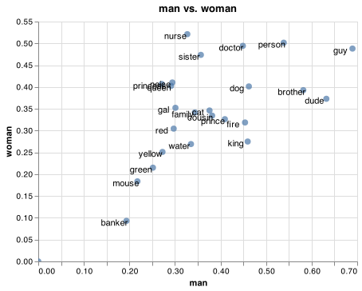

# F.A.Q.

## Plotting

### How do I save an interactive chart?

The interactive charts that our library produces are made with [altair](https://altair-viz.github.io/).
These charts use javascript for the interactivity and they are based on [vega](https://vega.github.io/vega-lite/).
You can represent the entire chart (including the data) as a json object. This means that you can always
save a visluatisation as an html page or as a json file.

```python
from whatlies.language import SpacyLanguage

words = ["prince", "princess", "nurse", "doctor", "banker", "man", "woman",
         "cousin", "neice", "king", "queen", "dude", "guy", "gal", "fire",
         "dog", "cat", "mouse", "red", "blue", "green", "yellow", "water",
         "person", "family", "brother", "sister"]

lang = SpacyLanguage("en_core_web_md")
emb = lang[words]

p = emb.plot_interactive('man', 'woman')
p.to_html("plot.html")
p.to_json("plot.json")
```

A tutorial on how this works exactly can be found [here](https://calmcode.io/altair/json.html).

### How do I save an interactive chart for publication?

You can also choose to save an interactive chart as an svg/png/pdf if you're interested
in using an [altair](https://altair-viz.github.io/) visualisation in a publication. More
details are listed on their [documentation page](https://altair-viz.github.io/user_guide/saving_charts.html?highlight=save%20svg#png-svg-and-pdf-format)
in short you'll need to install the `altair_saver` package for this functionality.

To get this code to work you [may](https://github.com/koaning/whatlies/issues/58) need to install some node
dependencies though. To install them locally in your project run;

```
npm install vega-lite vega-cli canvas
```

Once these are all installed, the following code snippet will work;

```python
from whatlies.language import SpacyLanguage
from altair_saver import save

words = ["prince", "princess", "nurse", "doctor", "banker", "man", "woman",
         "cousin", "neice", "king", "queen", "dude", "guy", "gal", "fire",
         "dog", "cat", "mouse", "red", "blue", "green", "yellow", "water",
         "person", "family", "brother", "sister"]

lang = SpacyLanguage("en_core_web_md")
emb = lang[words]

p = emb.plot_interactive('man', 'woman')
save(p, "chart.png")
```

This saves the following chart on disk;



### How do I change the title/size of the interactive chart?

The interactive charts are [Altair](https://altair-viz.github.io/index.html) charts
and that means that you could do something like this:

```python
from whatlies.language import SpacyLanguage

words = ["prince", "princess", "nurse", "doctor", "banker", "man", "woman",
         "cousin", "neice", "king", "queen", "dude", "guy", "gal", "fire",
         "dog", "cat", "mouse", "red", "blue", "green", "yellow", "water",
         "person", "family", "brother", "sister"]

lang = SpacyLanguage("en_core_web_md")
emb = lang[words]

p = emb.plot_interactive('man', 'woman')

p.properties(title="spaCy", height=200, width=200)
```

One common feature is that you might set the `width` to the container size
in order to achieve 100% width.

```
p.properties(title="spaCy", height=200, width="container")
```

## Languages

### How do I access nearest tokens from a language model?

This depends on the language model. If a language model isn't based on a vocabulary
 then we won't be able to retreive embeddings for it. Please check the docs if a
  language model has a `score_similar` method attached. For those that do, you can do:

```python
from whatlies.language import BytePairLanguage
lang = BytePairLanguage("en")
lang.score_similar("king")
```

This code snippet will return:

```python
[(Emb[king], 1.1102230246251565e-16),
 (Emb[▁king], 0.23501371664985227),
 (Emb[iv], 0.33016763827104456),
 (Emb[▁throne], 0.3366865106345296),
 (Emb[iii], 0.33745878416967634),
 (Emb[lord], 0.37137511153954517),
 (Emb[▁prince], 0.3806569732193965),
 (Emb[▁duke], 0.3889479082730939),
 (Emb[son], 0.3892961048683081),
 (Emb[ivals], 0.3904733871620414)]
```

In this case you'll see subword embeddings being return because that is what this
language model uses internally. Language models using spaCy would use full tokens.

### How do I access nearest tokens from a language model using an embedding?

You can pass this method a string, but also an embedding object. Ths can contain
a custom vector but you can also construct an embedding via operations. This makes the
API a lot more flexible. For example, we can construct this embedding;

```python
from whatlies.language import BytePairLanguage
lang = BytePairLanguage("en")
kmw = lang["king"] - lang["man"] + lang["woman"]
# Emb[((king - man) + woman)]
```

And use this embedding in our language model to retreive similar items.

```python
lang.score_similar(kmw, n=7)
```

This yields.

```python
[(Emb[king], 0.2620711370759745),
 (Emb[mother], 0.36575381150291),
 (Emb[father], 0.39737356910585997),
 (Emb[▁queen], 0.43554929266740294),
 (Emb[anne], 0.4583618203004909),
 (Emb[▁throne], 0.47000919280368636),
 (Emb[mary], 0.4771824121946612)]
```

Note that in general we're using cosine distance here but you can also pass the
`.score_similar` method a `metric` so select other metrics that are compatible with
scikit-learn.

### How do I retreive an embedding set from language model using similar tokens?

You can use the same flow we used in the previous two questions to generate an
embedding set that can be used for plotting.

```python
from whatlies.language import BytePairLanguage
lang = BytePairLanguage("en")
kmw = lang["king"] - lang["man"] + lang["woman"]
emb_king = lang.embset_similar(kmw, n=20)
```

## Compatibility

This project depends on a lot of backends so there's a risk of breaking changes whenever
we upgrade to a new version of a backend. The goal of this table is to list keep track of
compatible versions.


| whatlies | spaCy  |  tensorflow |
|----------|-------:|------------:|
|  0.4.5   |  2.2.4 |       2.3.0 |
|  0.5.0   |  2.3.2 |       2.3.0 |
|  0.6.0   |  3.0.0 |       2.3.0 |
