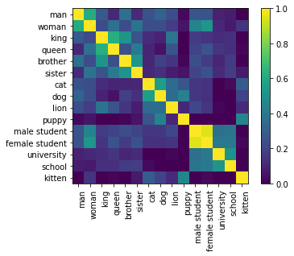

<script src="https://cdn.jsdelivr.net/npm/vega@5.10.0"></script>
<script src="https://cdn.jsdelivr.net/npm/vega-lite@4.6.0"></script>
<script src="https://cdn.jsdelivr.net/npm/vega-embed@6.3.2"></script>

# Installation

Whatlies is a library that tries to make it easy for you to play around with
text embeddings. To quickly get started with it, you can install via pip;

```
python -m pip install whatlies
```

## Fetching Embeddings

To fetch embeddings from a language backend you will first need to import a backend.
We'll use [byte pair embeddings](https://www.youtube.com/watch?v=-0IjF-7OB3s&ab_channel=Rasa) now.

```python
from whatlies.language import BytePairLanguage

bp_lang = BytePairLanguage("en")
```

You can use this language backend to fetch an embedding of a single word.

```python
emb_king = bp_lang["king"]
emb_king.vector
```

This is a single embedding, but you can also fetch many embeddings at the same time.

```python
words = ['man', 'woman', 'king', 'queen', 'brother', 'sister',
         'cat', 'dog', 'lion', 'puppy', 'male student', 'female student',
         'university', 'school', 'kitten']

embset = bp_lang[words]
```

This `embset` resembles an embeddingset which is a collection of embeddings.
Where a dataframe is a container for tabular data, this embeddingset is a container
for a set of embeddings. This container has many utility methods implemented. You can
for example turn it into a numpy array.

```python
embset.to_X()
```

## Visualisation

But you can also use it for visualisation.

```python
embset.plot_similarity(metric="cosine")
```



There are many visualisations implemented. In particular we offer interactive altair charts.
These can be useful to show how points are clustered. Before plotting this, it might be common
to apply a dimensionality reduction technique first.

```python
# To use the Umap feature you will need to install an extra dependency.
# pip install whatlies[umap]
from whatlies.transformers import Pca, Umap

p1 = embset.transform(Pca(2)).plot_interactive(title="pca")
p2 = embset.transform(Umap(2)).plot_interactive(title="umap")
p1 | p2
```

<div id="vis"></div>

<script>
fetch('chart.json')
.then(res => res.json())
.then((out) => {
  vegaEmbed('#vis', out);
})
.catch(err => { throw err });
</script>


These charts are fully interactive. You can zoom and drag with your cursor.

## Compatibility

The goal of this project is to have a single API for many different backends. We offer support
for:

- [spaCy](https://spacy.io/)
- [huggingface](https://huggingface.co/),
- [tensorflow hub](https://www.tensorflow.org/hub)
- [gensim](https://radimrehurek.com/gensim/)
- [bytepair](https://nlp.h-its.org/bpemb/)
- [fasttext](https://fasttext.cc/)
- [sentence transformers](https://www.sbert.net/index.html)

Note that you're not just limited to word embeddings, our API deals with text in general and
can also fetch embeddings for contextualized language models.

We also do our best to be compatible with popular tools like scikit-learn. Since we standardise
the output of our language backends we can give a familiar API to scikit-learn pipelines too.

```python
import numpy as np
from whatlies.language import BytePairLanguage
from sklearn.pipeline import Pipeline
from sklearn.linear_model import LogisticRegression

pipe = Pipeline([
    ("embed", BytePairLanguage("en")),
    ("model", LogisticRegression())
])

X = [
    "i really like this post",
    "thanks for that comment",
    "i enjoy this friendly forum",
    "this is a bad post",
    "i dislike this article",
    "this is not well written"
]

y = np.array([1, 1, 1, 0, 0, 0])

pipe.fit(X, y)
```

We hope this tools makes it easier for you to explore word-embeddings.