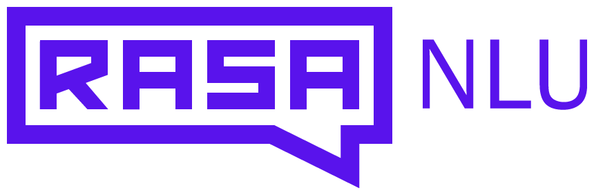

# whatlies 

A library that tries help you to understand. "What lies in word embeddings?"

This small library  offers tools to make visualisation easier of both
word embeddings as well as operations on them. This should be considered
an experimental project that is in preview mode. Feedback is super welcome. 

## Features

The idea is that you can load embeddings from a language backend 
and use mathematical operations on it. 

```python
from whatlies import EmbeddingSet
from whatlies.language import SpacyLanguage
lang = SpacyLanguage("en_core_web_md")
words = ["cat", "dog", "fish", "kitten", "man", "woman", 
         "king", "queen", "doctor", "nurse"]
emb = EmbeddingSet(*[lang[w] for w in words])
emb.plot(emb["man"], emb["woman"])
```


We also allow for mappings and operations! 

```python
royalty = emb['king'] - emb['queen']
gender = emb['man'] - emb['woman']
emb.plot(emb["man"], emb["woman"])
```


You can even do fancy operations. Like projecting unto and away
from vector embeddings! You can perform these on embeddings as 
well as sets of embeddings. 

```python
emb['man'] | (emb['man'] - emb['woman'])
# Emb[(man | (man - woman))]
emb | (emb['man'] - emb['woman'])
# (EmbSet | (man - woman))
```
But we also allow for BERT-style embeddings. Just use the square brackets. 

```python
lang = SpacyLanguage("en_trf_robertabase_lg")
lang['programming in [python]']
```

To learn more about this in detail; check out the [documentation](https://rasahq.github.io/whatlies/)! 

## Maintainers



This project was initiated at [Rasa](https://rasa.com) as a fun side project
that supports the research and developer advocacy teams at Rasa. 
It is maintained by Vincent D. Warmerdam, Research Advocate at Rasa.

## Documentation 

The docs can be found [here](https://rasahq.github.io/whatlies/).

## Installation 

For now we allow for installation with pip but only via git.

```bash
pip install git+https://github.com/RasaHQ/whatlies
```

## Local Development

If you want to develop locally you can start by running this command. 

```bash
make develop
```

### Documentation 

This is generated via

```
make docs
```
