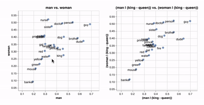

[](https://pepy.tech/project/whatlies)

# whatlies

A library that tries to help you to understand (note the pun).

> "What lies in word embeddings?"

This small library offers tools to make visualisation easier of both
word embeddings as well as operations on them.

## Produced


This project was initiated at [Rasa](https://rasa.com) as a by-product of
our efforts in the developer advocacy and research teams. The project is 
maintained by [koaning](https://github.com/koaning) in order to support more use-cases. 

## Features

This library has tools to help you understand what lies in word embeddings. This includes:

- simple tools to create (interactive) visualisations
- support for many language backends including spaCy, fasttext, tfhub, huggingface and bpemb
- lightweight scikit-learn featurizer support for all these backends

## Installation

You can install the package via pip;

```bash
pip install whatlies
```

This will install the base dependencies. Depending on the
transformers and language backends that you'll be using you
may want to install more. Here's some of the possible installation
settings you could go for.

```bash
pip install whatlies[spacy]
pip install whatlies[tfhub]
pip install whatlies[transformers]
```

If you want it all you can also install via;

```bash
pip install whatlies[all]
```

Note that this will install dependencies but it
**will not** install all the language models you might
want to visualise. For example, you might still
need to manually download spaCy models if you intend
to use that backend.

## Getting Started

More in depth getting started guides can be found on the [documentation page](https://koaning.github.io/whatlies/).

## Examples

The idea is that you can load embeddings from a language backend
and use mathematical operations on it.

```python
from whatlies import EmbeddingSet
from whatlies.language import SpacyLanguage

lang = SpacyLanguage("en_core_web_md")
words = ["cat", "dog", "fish", "kitten", "man", "woman",
         "king", "queen", "doctor", "nurse"]

emb = EmbeddingSet(*[lang[w] for w in words])
emb.plot_interactive(x_axis=emb["man"], y_axis=emb["woman"])
```


You can even do fancy operations. Like projecting onto and away
from vector embeddings! You can perform these on embeddings as
well as sets of embeddings.  In the example below we attempt
to filter away gender bias using linear algebra operations.

```python
orig_chart = emb.plot_interactive('man', 'woman')

new_ts = emb | (emb['king'] - emb['queen'])
new_chart = new_ts.plot_interactive('man', 'woman')
```



There's also things like **pca** and **umap**.

```python
from whatlies.transformers import Pca, Umap

orig_chart = emb.plot_interactive('man', 'woman')
pca_plot = emb.transform(Pca(2)).plot_interactive()
umap_plot = emb.transform(Umap(2)).plot_interactive()

pca_plot | umap_plot
```


## Scikit-Learn Support

Every language backend in this video is available as a scikit-learn featurizer as well.

```python
import numpy as np
from whatlies.language import BytePairLanguage
from sklearn.pipeline import Pipeline
from sklearn.linear_model import LogisticRegression

pipe = Pipeline([
    ("embed", BytePairLanguage("en")),
    ("model", LogisticRegression())
])

X = [
    "i really like this post",
    "thanks for that comment",
    "i enjoy this friendly forum",
    "this is a bad post",
    "i dislike this article",
    "this is not well written"
]

y = np.array([1, 1, 1, 0, 0, 0])

pipe.fit(X, y)
```

## Documentation

To learn more and for a getting started guide, check out the [documentation](https://koaning.github.io/whatlies/).

## Similar Projects

There are some similar projects out and we figured it fair to mention and compare them here.

<details>
  <summary><b>Julia Bazińska & Piotr Migdal Web App</b></summary>
    <p>The original inspiration for this project came from <a href="https://lamyiowce.github.io/word2viz/">this web app</a>
    and <a href="https://www.youtube.com/watch?v=AGgCqpouKSs">this pydata talk</a>. It is a web app that takes a
    while to load but it is really fun to play with. The goal of this project is to make it easier to make similar
    charts from jupyter using different language backends.</p>
</details>

<details>
    <summary><b>Tensorflow Projector</b></summary>
    <p>From google there's the <a href="https://projector.tensorflow.org/">tensorflow projector project</a>. It offers
    highly interactive 3d visualisations as well as some transformations via tensorboard.</p>
    <ul>
    <li>The tensorflow projector will create projections in tensorboard, which you can also load
    into jupyter notebook but whatlies makes visualisations directly.</li>
    <li>The tensorflow projector supports interactive 3d visuals, which whatlies currently doesn't.</li>
    <li>Whatlies offers lego bricks that you can chain together to get a visualisation started. This
    also means that you're more flexible when it comes to transforming data before visualising it.</li>
    </ul>
</details>

<details>
    <summary><b>Parallax</b></summary>
    <p>From Uber AI Labs there's <a href="https://github.com/uber-research/parallax">parallax</a> which is described
    in a paper <a href="https://arxiv.org/abs/1905.12099">here</a>. There's a common mindset in the two tools;
    the goal is to use arbitrary user defined projections to understand embedding spaces better.
    That said, some differences that are worth to mention.</p>
    <ul>
    <li>It relies on bokeh as a visualisation backend and offers a lot of visualisation types
    (like radar plots). Whatlies uses altair and tries to stick to simple scatter charts.
    Altair can export interactive html/svg but it will not scale as well if you've drawing
    many points at the same time.</li>
    <li>Parallax is meant to be run as a stand-alone app from the command line while Whatlies is
    meant to be run from the jupyter notebook.</li>
    <li>Parallax gives a full user interface while Whatlies offers lego bricks that you can chain
    together to get a visualisation started.</li>
    <li>Whatlies relies on language backends (like spaCy, huggingface) to fetch word embeddings.
    Parallax allows you to instead fetch raw files on disk.</li>
    <li>Parallax has been around for a while, Whatlies is more new and therefore more experimental.</li>
    </ul>
</details>

## Local Development

If you want to develop locally you can start by running this command.

```bash
make develop
```

### Documentation

This is generated via

```
make docs
```

### Citation

Please use the following citation when you found `whatlies` helpful for any of your work (find the `whatlies` paper [here](https://www.aclweb.org/anthology/2020.nlposs-1.8)):
```
@inproceedings{warmerdam-etal-2020-going,
    title = "Going Beyond {T}-{SNE}: Exposing whatlies in Text Embeddings",
    author = "Warmerdam, Vincent  and
      Kober, Thomas  and
      Tatman, Rachael",
    booktitle = "Proceedings of Second Workshop for NLP Open Source Software (NLP-OSS)",
    month = nov,
    year = "2020",
    address = "Online",
    publisher = "Association for Computational Linguistics",
    url = "https://www.aclweb.org/anthology/2020.nlposs-1.8",
    doi = "10.18653/v1/2020.nlposs-1.8",
    pages = "52--60",
    abstract = "We introduce whatlies, an open source toolkit for visually inspecting word and sentence embeddings. The project offers a unified and extensible API with current support for a range of popular embedding backends including spaCy, tfhub, huggingface transformers, gensim, fastText and BytePair embeddings. The package combines a domain specific language for vector arithmetic with visualisation tools that make exploring word embeddings more intuitive and concise. It offers support for many popular dimensionality reduction techniques as well as many interactive visualisations that can either be statically exported or shared via Jupyter notebooks. The project documentation is available from https://koaning.github.io/whatlies/.",
}
```
